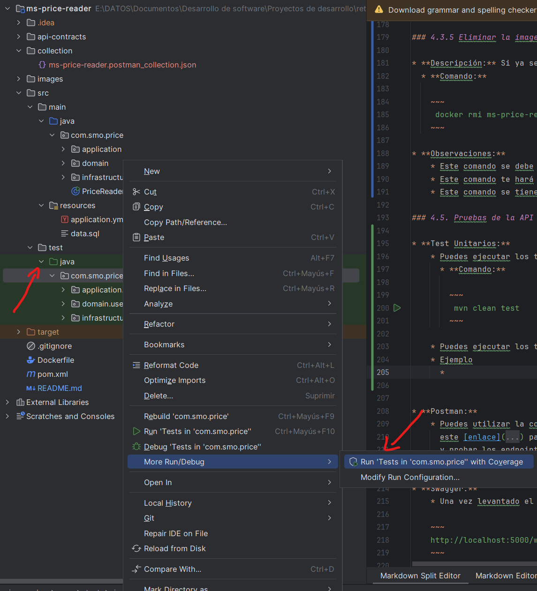
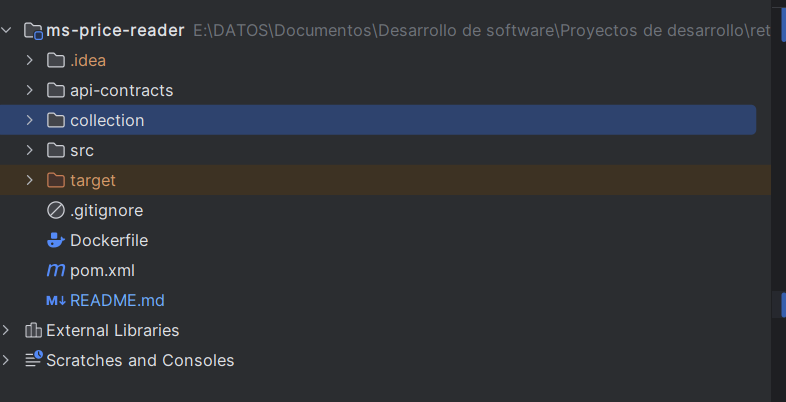
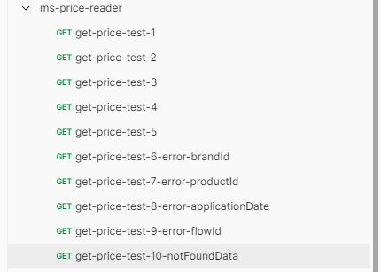
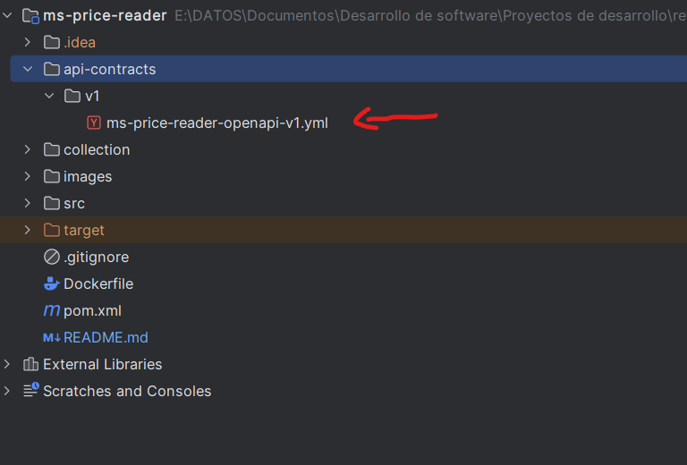

|    Date    |    Description    |        Made by         |
|:----------:|:-----------------:|:----------------------:|
| 22/06/2025 | Document Creation | Sebastian Medina Ochoa |

# Microservice documentation

## Table of Contents

1. [General Information](#1-general-information)
2. [Endpoints](#2-endpoints)
3. [Contact and Support](#3-contact-and-support)
4. [Running the Microservice](#4-running-the-microservice)
5. [API Testing](#5-api-testing)
6. [Documentation With Swagger-UI](#6-documentatión-the-api-with-swagger-ui)

## 1. General information

### 1.1 API Name

* **Name:** ms-price-reader
* **Service classification:** This microservice retrieves the applicable price for a product given date and brand
  conditions of a product based on established parameters.
* **Current version:** v1.0.0
* **Owner:** Sebastian Medina Ochoa

### 1.2 Purpose of the API

* **Description:** Service that provides read access to the pricing data stored in the database.
* **Service objectives:** Be able to read the price table from the database.
* **Target Users:** Services that require reading the database to the price table.

### 1.3 Details of Fields in the Request and Response

This section describes the fields used in API requests and responses.

### Headers

| Field Name | Description            | Data Type | Mandatory Data | Allowed Values | Observations                                                                                                          |
|:-----------|:-----------------------|:----------|:---------------|:---------------|:----------------------------------------------------------------------------------------------------------------------|
| `flowId`   | Unique flow identifier | String    | SI             | UUID VALUES    | The idea is that each request has a different flowId to be able to identify it in the logs in the application support |

## 2. Endpoints

### 2.1 Endpoint List

| Method | Endpoint                                                                  | Description                                                                                                                        | 
|:-------|:--------------------------------------------------------------------------|:-----------------------------------------------------------------------------------------------------------------------------------|
| `GET`  | "/price/v1/get?applicationDate={value}&productId={value}&brandId={value}" | Obtains the price that applies to a given combination of product, brand, and date, considering the priority among available rates. |

### 2.2 Data Validation

To ensure the integrity of data received and sent through the APIs, validations must be performed on all fields in
requests and responses. Below are some examples of validations:

1. **Field `applicationDate`:**

    * **Data Type:** LocalDateTime `LocalDateTime`.
    * **Validation:** Must not be null or empty and cannot have an incorrect format.

2. **Field `productId`:**

    * **Data Type:** Integer `Integer`.
    * **Validation:** Must not be null or empty and cannot have an incorrect format.

3. **Field `brandId`:**

    * **Data Type:** Integer `Integer`.
    * **Validation:** Must not be null or empty and cannot have an incorrect format.

4. **Field `flowId`:**

    * **Data Type:** String `String`.
    * **Validation:** Must not be null or empty and cannot have an incorrect format.

## 3. Contact and Support

### 3.1. Contact Information

* **Support Email:** "sebasthyy1@gmail.com"

## 4. Running the Microservice

### 4.1. Prerequisites

* **Required Tools**
    * **Maven:** For building the microservice without Docker.
    * **Docker:** For building the project with an image and container.
    * **Java:** For interpreting the language in which the microservice is developed.

### 4.1.1 Maven

* **Recommendations**
    * **Version:** Have Maven version 3.9.9 installed (recommended)

### 4.1.2 Docker

* **Recommendations**
    * **Version:** Have __Docker version 27.5.1__ installed (recommended)

### 4.1.3 Java

* **Recommendations**
    * **Version:** Have __Java 21.0.5__ installed (recommended)

### 4.2. Building the Microservice Without Docker

* **Description:** To build the microservice from the project root.
    * **Command:**

        ~~~
        mvn spring-boot:run
        ~~~

* **Observations:**
    * The command generates the necessary artifacts for service execution and to run the microservice without docker you
      need to have the other tools installed, such as Java and Maven.

### 4.3. Building the Microservice With Docker

* **Description:** To build the image with Docker you have to run the following command
    * **Command:**

      ~~~
      docker build -t ms-price-reader .
      ~~~

* **Observations:**
    * This command must be executed in the directory where the __Dockerfile__ is located

### 4.3.1 Run the container

* **Description:** To run the container with the image we created previously you must run the following command
    * **Command:**

      ~~~
       docker run -p 8080:8080 --name price-service ms-price-reader
      ~~~
    * **Or if you want to run it again, run this command:**

      ~~~
       docker start price-service
      ~~~

* **Observations:**
    * This command must be executed in the directory where the __Dockerfile__ is located
    * This command will also let you see the logs at runtime to know what happens inside the microservice with each
      request launched.

### 4.3.2 View logs at runtime

* **Description:** In case you have exited the terminal where you are viewing the microservice logs you can re-enter to
  view them with the following command
    * **Command:**

      ~~~
       docker logs -f price-service
      ~~~

* **Observations:**
    * This command must be executed in the directory where the __Dockerfile__ is located
    * This command will let you see all the logs at runtime to know what happens inside the microservice with each
      request launched.

### 4.3.3 Pause the created container

* **Description:** If you have finished performing the relevant tests or finished using the microservice you can pause
  the container with the following command
    * **Command:**

      ~~~
       docker stop price-service 
      ~~~

* **Observations:**
    * This command must be executed in the directory where the __Dockerfile__ is located
    * This command will pause the container we created previously called __price-service__.

### 4.3.4 Delete the created container

* **Description:** If you have finished performing the relevant tests or finished using the microservice you can delete
  the container with the following command
    * **Command:**

      ~~~
       docker rm price-service  
      ~~~

* **Observations:**
    * This command must be executed in the directory where the __Dockerfile__ is located
    * This command will delete the container we created previously called __price-service__.
    * This command must be executed after having paused the container called __price-service__.

### 4.3.5 Delete the created image

* **Description:** If you have finished performing the relevant tests or finished using the microservice you can delete
  the image with the following command
    * **Command:**

      ~~~
       docker rmi ms-price-reader 
      ~~~

* **Observations:**
    * This command must be executed in the directory where the __Dockerfile__ is located
    * This command will delete the image we created previously called __ms-price-reader__.
    * This command must be executed after having deleted the container called __price-service__.

### 5. API Testing

* **Unit Tests:**
    * You can run the unit tests created for the entire microservice with the following command
    * **Remember that you have to have the microservice running either locally or with Docker to pass the e2e tests.**
        * **Command:**

          ~~~
           mvn clean test 
          ~~~

    * You can run the unit tests created for the entire microservice from the executor of the tool in which you compile
      the project you can do the following
    * Example
        * 

### 5.1 API Testing With Karate End-to-End

### 5.1.1 Overview

* **This project includes end-to-end tests written in Karate to validate that the microservice correctly processes
  requests and returns the expected results based on the pricing rules.**

### 5.1.2 Prerequisites

* **Ensure the following before running the Karate tests:**
    * The microservice must be running locally on port 8080
        * **You can run it using::**
            ~~~
             mvn spring-boot:run
            ~~~
        * **Or using Docker::**
            ~~~
             docker run -p 8080:8080 --name price-service ms-price-reader
            ~~~

### 5.1.3 Run the Tests with Maven

* **From the root of the project, execute the following command:**
    ~~~
     mvn test
    ~~~
* **This command runs all JUnit tests, including the Karate runner PriceReaderTest, which is located in:**
    ~~~
     src/test/java/com/smo/price/integration/PriceReaderTest.java
    ~~~ 
* **This runner executes the .feature file found at:**
    ~~~
    src/test/resources/features/price-reader.feature
    ~~~

### 5.1.4 Viewing the Results

* **After the tests finish running:**
    * **Open the target folder:**
        ~~~
         target/karate-reports/
        ~~~
    * **Open the file:**
        ~~~
         karate-summary.html
        ~~~ 
    * **You can also see logs and detailed reports inside:**
       ~~~
        target/surefire-reports/
       ~~~

### 5.2 API Testing With Postman

* **Postman:**
    * You can access the Postman collection by opening the folder that is in the root of this project called __collection__:
        * 
        * You import the collection into postman and you can use it.
    * Inside the collection you will have the 10 selected test cases to test from the tool
        * 

### 6. Documentatión The Api With Swagger-UI

* **Swagger:**
    * Once the microservice is up with or without Docker, go to the following URL from your browser to see the
      documentation with Swagger-UI:

    ~~~
    http://localhost:8080/price/v1/swagger-ui/index.html 
    ~~~

    * Here you can see all the documentation about the endpoints, request, response objects, headers or parameters. This
      documentation is with springdoc so you will see the description of all the fields or objects that they are, what
      they are for or examples of data you can send
    * Here you can modify the data as you wish to verify the functionality or fetch different information from the
      database
    * You can also see the yml generated by spring doc from the folder located in the root of this project called __api-contracts__
        * 

Sebastian Medina Ochoa © 2025
